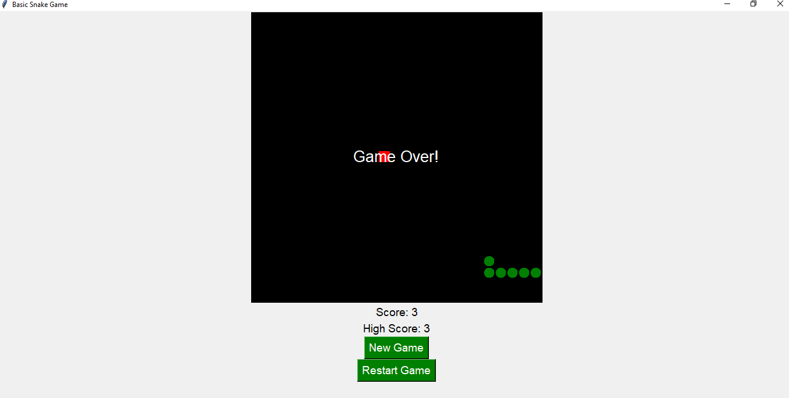

# Basic Snake Game

This is a simple Snake game built using Python's Tkinter module. The player controls a snake to eat food and grow while avoiding collisions with the walls and itself.

## Features
- Classic snake movement with arrow keys
- Score tracking with high score
- Restart functionality upon game over
- Simple and minimalistic design

## Requirements
- Python 3.x
- Tkinter (comes pre-installed with Python)

## How to Run
1. Ensure you have Python installed on your system.
2. Download or copy the `snake_game.py` file.
3. Open a terminal or command prompt in the directory where the file is located.
4. Run the following command:
   ```bash
   python snake_game.py
   ```
5. Use arrow keys to control the snake.

## Controls
- **Arrow Up**: Move Up
- **Arrow Down**: Move Down
- **Arrow Left**: Move Left
- **Arrow Right**: Move Right

## Game Rules
- Eat the red food to grow and increase your score.
- The game ends if the snake collides with the walls or itself.
- Your high score is updated when you surpass your previous best score.

## Screenshot


## License
This project is open-source and free to use for educational purposes.

---

Enjoy playing the game!

